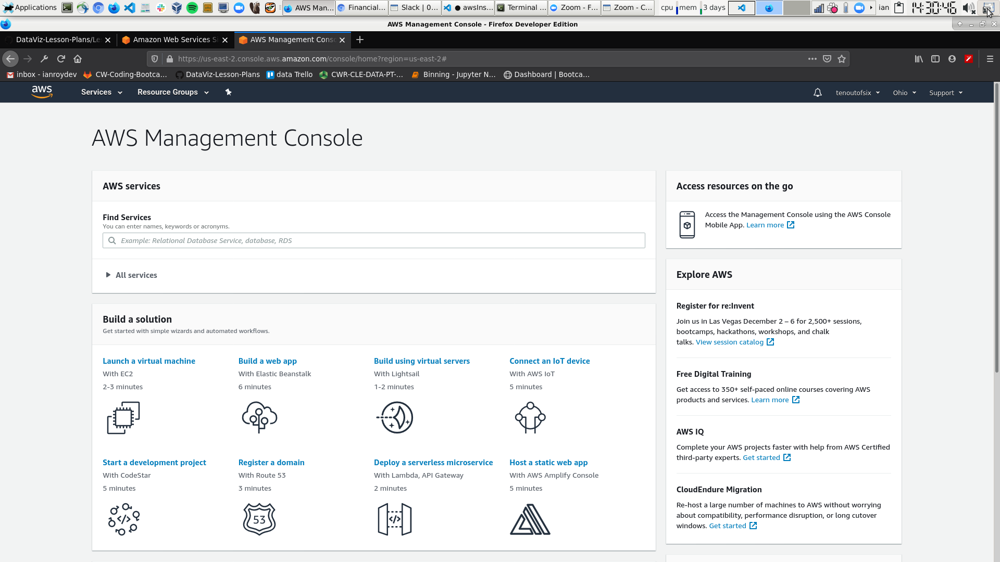
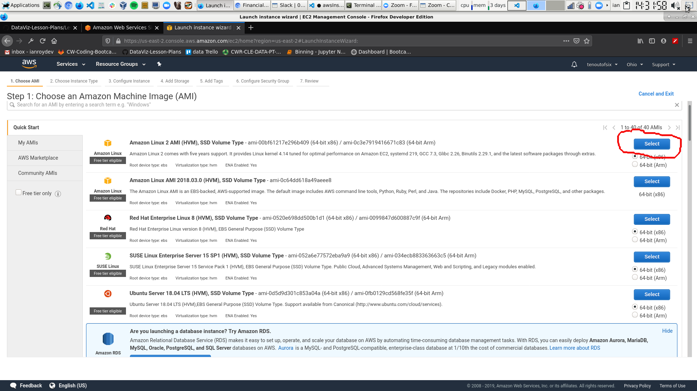
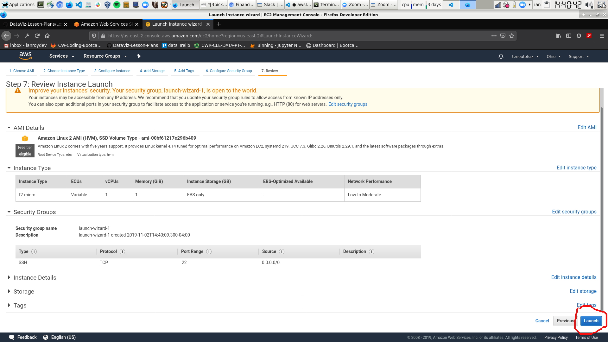
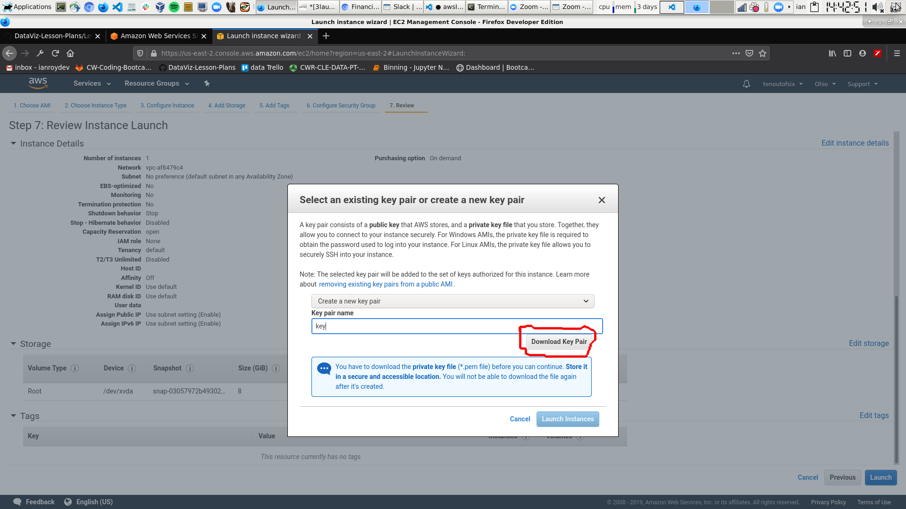
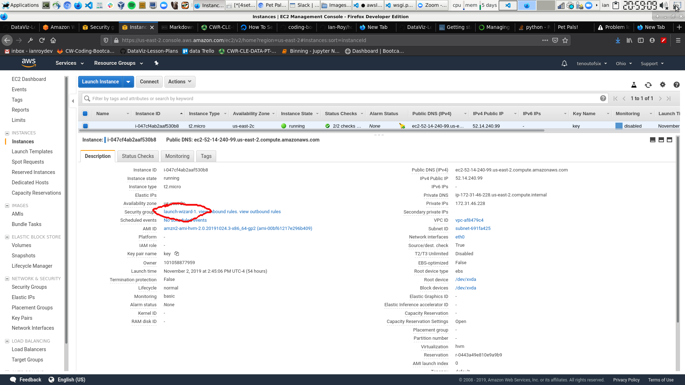

set up ec2 linux instance 

set up git repo for project

<!-- make a new virtual env
`conda create -n app1 `
`conda activate app1` -->

set up ssh keys on ec2 so we can pull from repo. 
` ssh-keygen -t rsa`

do git pull on ec2 

run ec2-setup.sh
`./ec2-setup.sh`

use pip to install all of your dependencies 
`pip install -r requirements.txt --user`

start flask and gunicorn app 
`gunicorn --bind 0.0.0.0:5000 wsgi:app`

maybe use tmux to keep it running 

open up port 5000 and 80 on aws 

